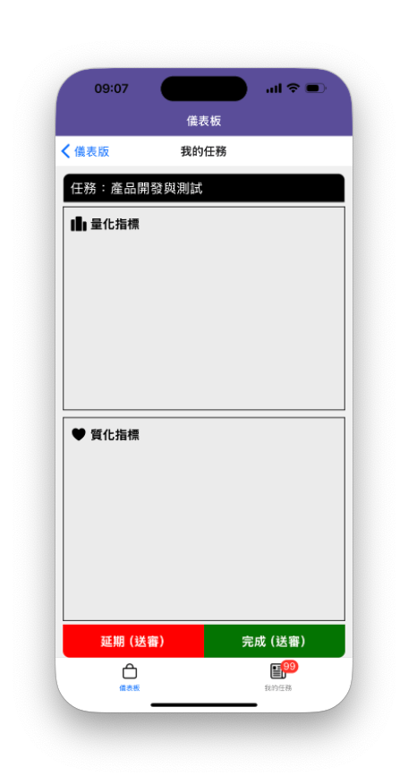
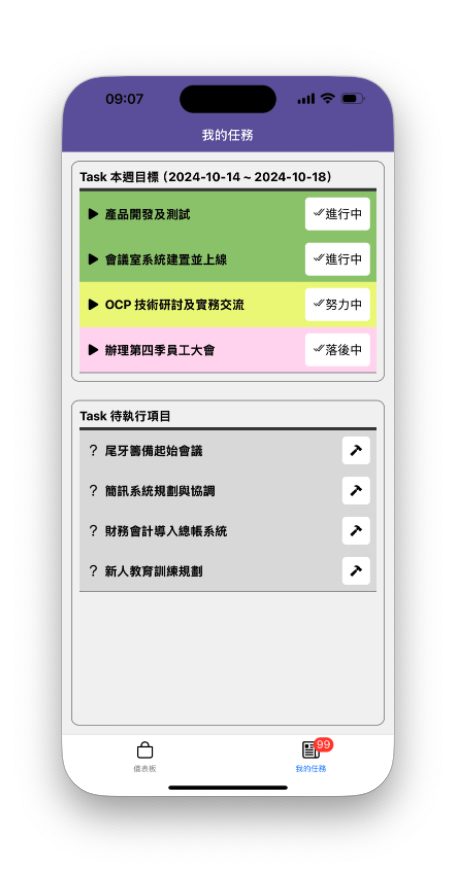

# React Native 第 2 章，作業 2 - 同時具備兩種換頁的APP

Hahow 課程：跨平台 APP - React Native 快速學習攻略（[課程連結](<https://hahow.in/courses/5dbe90cfa4b1c600214d0ab5/discussions?item=5e142f57f1ed6606cb441dea>)）

    需求說明
       ・開發具有 Bottom Tab Navigation 的機制
       ・開發具有 Stack Navigation 的機制   
    
    頁面說明
    
       ・儀表板：APP 進入後的首頁
       ・我的任務(單筆)：由儀表板點選任務後進入
       ・我的任務(清單)：由下方的 Tab 切換進入
    
    

## 案例 ： 儀表板：APP 進入後的首頁

## 案例 ： 我的任務(單筆)：由儀表板點選任務後進入

## 案例 ： 我的任務(清單)：由下方的 Tab 切換進入

