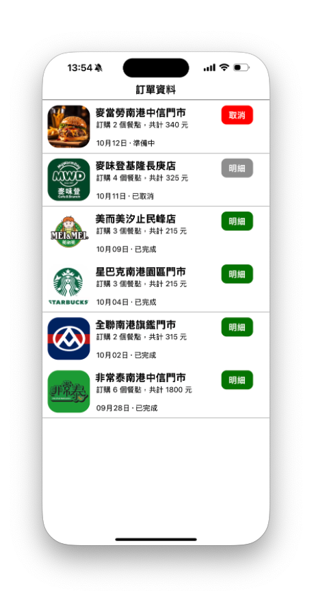

# React Native 第 2 章，作業 1 - 自製元件

Hahow 課程：跨平台 APP - React Native 快速學習攻略（[課程連結](<https://hahow.in/courses/5dbe90cfa4b1c600214d0ab5/discussions?item=5e142f57f1ed6606cb441dea>)）

    需求說明
    
       ・自訂客製化元件：MyFood，用以呈現一筆訂餐資料
       ・依狀態呈現不同按鈕（顏色及文字不同）
    
    

## 案例 ： 模擬 UBER 頁面

