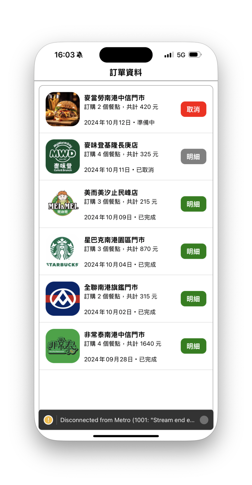

# React Native 第 2 章，作業 3 - 自製data列表(含圖片)

Hahow 課程：跨平台 APP - React Native 快速學習攻略（[課程連結](<https://hahow.in/courses/5dbe90cfa4b1c600214d0ab5/discussions?item=5e142f57f1ed6606cb441dea>)）

    需求說明
    
       ・在 Mocked Data 新增圖片與傳遞
       ・資料列表化
    
    
## 案例 ： 模擬 UBER 頁面


## 定義 Mocked Data 資料
```json
const MOCKED_DATA = [
  {
    storeName:'麥當勞南港中信門市',
    count:2,
    sumAmt:420,
    date:'2024年10月12日',
    status:'準備中',
    image:'https://www.foodiesfeed.com/wp-content/uploads/2023/06/burger-with-melted-cheese.jpg'
  },
  {
    storeName:'麥味登基隆長庚店',
    count:4,
    sumAmt:325,
    date:'2024年10月11日',
    status:'已取消',
    image:'https://encrypted-tbn0.gstatic.com/images?q=tbn:ANd9GcRVRLwJY8m-dtFYyzDxEbUr-Bn8W4WIbqJzEg&s'
  },
  {
    storeName:'美而美汐止民峰店',
    count:3,
    sumAmt:215,
    date:'2024年10月09日',
    status:'已完成',
    image:'https://encrypted-tbn0.gstatic.com/images?q=tbn:ANd9GcRnMSX6uBUUQze22O3WLBM-XxK3NvhRSjW-Cw&s'
  },
  {
    storeName:'星巴克南港園區門市',
    count:3,
    sumAmt:870,
    date:'2024年10月04日',
    status:'已完成',
    image:'https://media.gq.com.tw/photos/5dbc7df10327d200088366e3/16:9/w_1280,c_limit/2017022171286265.jpg'
  },
  {
    storeName:'全聯南港旗鑑門市',
    count:2,
    sumAmt:315,
    date:'2024年10月02日',
    status:'已完成',
    image:'https://www.brandinlabs.com/wp-content/uploads/2014/05/PX.gif'
  },
  {
    storeName:'非常泰南港中信門市',
    count:4,
    sumAmt:1640,
    date:'2024年09月28日',
    status:'已完成',
    image:'https://encrypted-tbn0.gstatic.com/images?q=tbn:ANd9GcTWS80F0fCus8BIHRqWPoPWTmUMKD6ruIcR1Q&s'
  },
]
```

## 資料列表化
``` html
<FlatList 
    data={dataSource}
    renderItem={(order)=>renderOrder(order)}
    style={{width:'95%', alignSelf:'center', marginTop:10, marginBottom:30, borderRadius:10, borderWidth:1, borderColor:'#999999'}}
/>
```